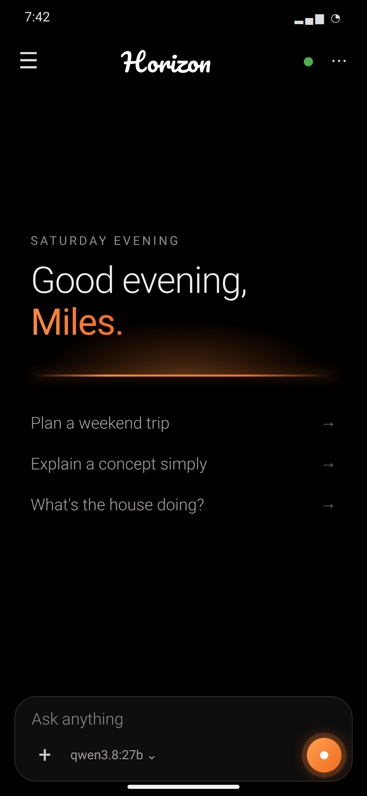
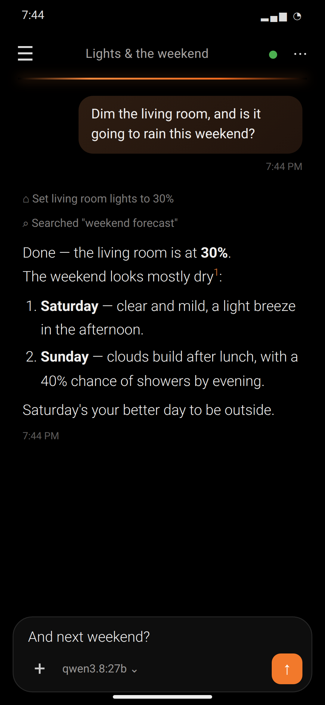
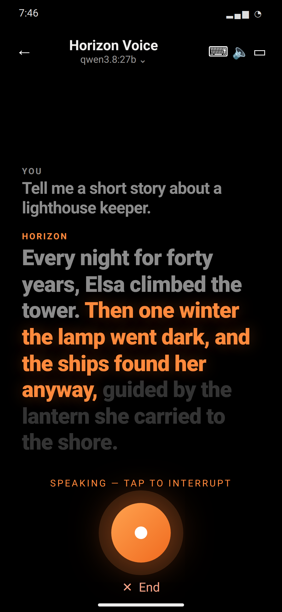

<div align="center">


# Horizon

**A calm AI app for the models you run and the ones you don't.**
Local models on your own hardware, hundreds of hosted ones through OpenRouter, tools that search the web and run your home, and a voice you can simply talk to — in an app built around light, space and a little warmth.

[**Download the latest release ▸**](https://github.com/60MilesPerHour/Horizon/releases)

</div>

<p align="center">
  
  &nbsp;
  
  &nbsp;
  
</p>

---

## What it does

**Talk to any model.** Ollama on your own machine (or Ollama Cloud) and every model on [OpenRouter](https://openrouter.ai) — Claude, GPT, Gemini, Llama, Qwen and hundreds more — side by side. Switch models mid-conversation without losing the thread. The picker shows what each model can actually do (vision, tools, thinking), read from the provider rather than guessed from a name.

**Tools, when a question needs them.** The model can search the web (your own SearXNG, or SerpAPI), read the pages it finds, check the time, and cite its sources. Point Horizon at **Home Assistant** and it can read your sensors and control your home — "is the garage shut?", "dim the living room" — looking entity ids up rather than guessing them. Opt a chat in, and other conversations can search it when they need something you worked out there.

**Horizon Voice.** A voice mode that works like a conversation, not a form:
- words appear as you speak, transcribed live by a Whisper server you run;
- it knows when you've finished — from what you're saying, not just how loud the room is — and keeps listening turn after turn;
- a second, more accurate pass cleans up the transcript before it's sent;
- replies are read aloud and shown like lyrics, the sentence being spoken lit in orange;
- say **"Hey Horizon"** to start it hands-free — detected entirely on your phone, even with the app in the background. Or long-press power, if Horizon is your assistant.

Any reply in any chat can be read aloud from its menu, too.

**Every chat, its own way.** Model, system prompt, temperature, context size, thinking on or off — all per conversation. Branch a chat at any message to explore another path, edit and regenerate, attach photos and documents, and export or import conversations as Markdown.

**Private by design.** Your conversations go only where you point them. Settings → Security & Privacy is generated from your actual configuration: every destination, what goes there, whether it's active right now, and where each credential lives — including the awkward parts, like OpenRouter passing your conversation to whoever serves the model. Keys live in the OS keystore, never in plain settings.

**Built for self-hosting.** A primary and a backup address for every server you run, with automatic failover — your LAN address at home, a Tailscale or tunnel hostname away from it — plus bearer tokens and Cloudflare Access service tokens where you need them.

**Yours to look at.** Light, dark or system; true black or dim; any accent colour and palette style; corner radius, text size, density; and a greeting by name.

## Install

| Platform | Download | Notes |
|---|---|---|
| **Android** | `horizon-vX.Y.Z.apk` from [Releases](https://github.com/60MilesPerHour/Horizon/releases) | Signed. Sideload from Files or with adb. |
| **macOS** | `horizon-macos.zip` | Unsigned. After unzipping: `xattr -dr com.apple.quarantine /Applications/Horizon.app` |
| **Windows** | `horizon-windows.zip` | Extract and run `horizon.exe`. |
| **Debian / Ubuntu** | `horizon_X.Y.Z_amd64.deb` | `sudo apt install ./horizon_X.Y.Z_amd64.deb` |
| **Other Linux** | `horizon-X.Y.Z-linux-x64.tar.gz` | Extract and run `./horizon`. |
| **iOS** | Not distributed | Builds from source with an Apple developer account. |

## Set up

1. **A model.** Settings → Ollama Server → your server's address (`http://<host>:11434`), plus an optional backup address for when you're away from home. For Ollama Cloud, use `https://ollama.com` and your `olc-…` token. And/or Settings → Cloud Models → an OpenRouter key.
2. **Tools** *(optional)*. Settings → Tools & Web Search → a SearXNG address or a SerpAPI key. Reading pages and checking the time work without either.
3. **Home Assistant** *(optional)*. Settings → Home Assistant → your instance URL and a long-lived access token. "Test connection" tells you which one is wrong.
4. **Voice** *(optional)*. Settings → Voice. For live transcription, run a WhisperLive server and enter its address under Live; add a Whisper-compatible server (such as Speaches) under Accuracy pass. Choose how replies are spoken — the device's own voice, a self-hosted one, or ElevenLabs — and turn on "Hey Horizon" if you want it.

### Running the voice servers

Live transcription is [WhisperLive](https://github.com/collabora/WhisperLive) on a GPU:

```bash
docker run -d --gpus all -p 9090:9090 ghcr.io/collabora/whisperlive-gpu:latest \
  python run_server.py --port 9090 --backend faster_whisper \
  -fw deepdml/faster-whisper-large-v3-turbo-ct2
```

`-fw` loads one model and shares it, so a new conversation connects instantly instead of loading a model each time. For the accuracy pass and self-hosted speech, [Speaches](https://github.com/speaches-ai/speaches) serves both Whisper and Kokoro behind the OpenAI-compatible API.

## Build from source

```bash
git clone https://github.com/60MilesPerHour/Horizon.git
cd Horizon
flutter pub get
flutter run                   # the connected device
flutter build apk --release   # Android
```

Needs Flutter 3.44 (what CI builds with) and Dart 3.12. CI builds Android, iOS, macOS, Windows and Linux on every push to `main`; releases are cut from `v*` tags.

## Contributing

Issues and pull requests are welcome. A few things worth knowing:
- Keep every platform building — CI checks all five.
- Anything on the request path should respect the chat's own provider and settings.
- New providers go in `lib/Services/<name>_service.dart` and register through `ChatServiceRegistry`.

## Origins

Horizon was born out of Reins, İbrahim Çetin's Flutter client for Ollama, and grew from there into its own app. [ORIGINS.md](ORIGINS.md) tells the story, and says thank you.

## License

[GPL-3.0](LICENSE). Portions derived from Reins, © 2024–2026 İbrahim Çetin, also under GPL-3.0. Modifications and additions © 2026 Miles Oldenburger.
